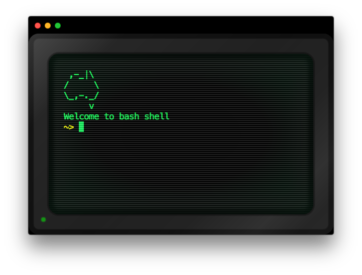

# hyper-vintage

Vintage/retro terminal style for [hyper](https://hyper.is/) adapted from https://github.com/andersevenrud/retro-css-shell-demo

## How to use

Run `hyper i hyper-vintage` in the Hyper terminal, or add `hyper-vintage` to `plugins` in `~/.hyper.js`.
